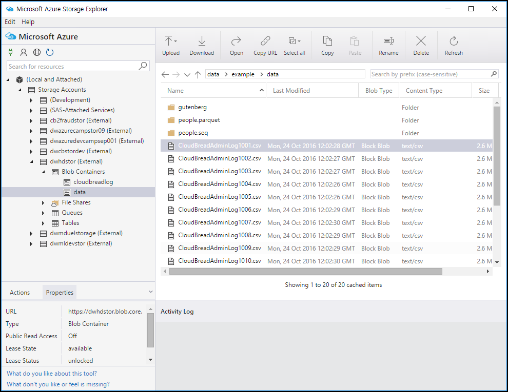
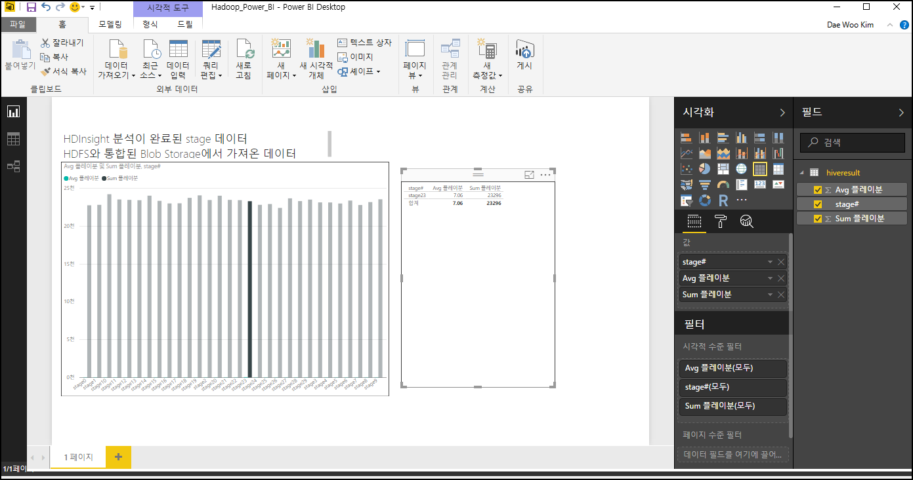

# Azure HNN project content repo
이 repo는 HNN project hackfest를 위한 content 프로젝트  

## Azure storage SDK 코드
Hackfest에 필요한 storage에 접근 처리하기 위한 SDK 및 예제 코드  

## Azure HDInsight Data & Hive 스크립트 - 로그 분석
hackfest간 HDInsight 검토를 위한 테스트 데이터 및 Hive 쿼리 참조  
적재되는 NoSQL기반 로그 데이터를 Big-data Hadoop을 활용해 분석  

**모바일 게임의 스테이지 레벨(난이도) 디자인 분석**  
- 목표정의 : 30여개의 스테이지가 존재하는 캐주얼 게임. 스테이지별로 난이도를 적절히 유지하기 위해, 해당 스테이지별로 클리어에 소요되는 시간 등을 기록해 스테이지 난이도를 조절하는데 사용하기 희망. 이를 위해 Closed Beta 서비스를 7일간 진행했고, 7일간 수집된 로그에서 스테이지별 난이도 분석을 희망  

- 기본정보 : 게임의 스테이지 정보는 Member : MemberGameInfoStage 테이블에 one to many relationship으로 정의되어 있음. 이 정보는 RDBMS이기 때문에 state 정보만을 저장해 log성으로 남기지는 않음.  

- 일별 적재되는 로그 데이터에서 식별자를 이용해 Hadoop에서 Hive를 수행하면 원하는 스테이지별 클리어 소요 시간을 계산 가능  

- HDInsight의 HDFS는 Blob Storage와 호환됨  

- Blob 처리를 위한 [Storage Explorer](http://storageexplorer.com/) 개발 도구에서 blob 을 로드. blob들은 *"wasbs:///example/data/"* 하위로 매핑됨  

- 
Storage Explorer 개발 도구에서 blob 을 로드하는 화면

- 로드된 csv 파일의 구조  

	PartitionKey|RowKey|Timestamp|Date|Level|Logger|Message
---|---|---|---|---|---|---|
BECA21F0-8B5E-4877-A18A-FD2A4B04322D|4DC0C4A6-893C-4246-AF80-B990EDD10C54|0.011269676|2016-09-10T04:29:50.828Z|stage5|CBComInsMemberGameInfoStages|9
6EDC9E0F-5E7E-4A04-B420-5F3091052CE7|819F7AC7-61E9-40C8-9904-B53B1008311E|0.011269676|2016-06-13T17:40:10.131Z|stage21|CBComInsMemberGameInfoStages|14
9F86454F-4E96-4CAD-A0AE-05DED005774F|766461D9-5FE6-4135-8FB3-15AACE24C4A8|0.011269676|2016-10-18T08:06:05.589Z|stage15|CBComInsMemberGameInfoStages|7
920E72B5-377C-4590-82D5-387ED86EF757|3AB215E0-AAE7-4E69-AF8B-825FADBAF756|0.011269676|2016-06-13T17:38:02.779Z|stage14|CBComInsMemberGameInfoStages|1
	일별, 약 1만건 정도의 데이터는 클라이언트에서 들어온 스테이지 및 클리어 소요 시간 정보를 로그로 적재  
- 항목들을에 대해 message의 소요 시간(분)을 처리  

- Hive 쿼리를 수행하기 위해 HDInsigt Cluster Manager 수행  

-   

- Hive 쿼리 수행을 준비  

-   

- csv파일들을 Hive에서 External Table로 load 작업 수행  
    ```
    set hive.execution.engine=tez;
    DROP TABLE cloudbreadlog;
    CREATE EXTERNAL TABLE cloudbreadlog (
        PartitionKey string, 
        RowKey string, 
        `Timestamp` string, 
        `Date` string, 
        Level string, 
        Logger string, 
        Message string
    )
    ROW FORMAT DELIMITED FIELDS TERMINATED BY ','
    STORED AS TEXTFILE LOCATION 'wasbs:///example/data/';
    SELECT 
        * 
    FROM 
        cloudbreadlog 
    WHERE 
        INPUT__FILE__NAME LIKE '%.csv' 
    --	where Logger like 'CBComInsMemberGameInfoStages'
    --	AND INPUT__FILE__NAME LIKE '%.csv' 
    --order by level asc;
    ```  
	Hive 쿼리를 수행
- Hive의 External Table로 로드 되었는지 count 체크
    ```
    SELECT count(*) FROM cloudbreadlog;
    ```

- 빠른 처리를 위해 Internal Table ORC(Optimized Row Columnar) 테이블로 로드
    ```
    set hive.execution.engine=tez;
    CREATE TABLE IF NOT EXISTS CloudBreadStageTime(
        PartitionKey string, 
        RowKey string, 
        `Timestamp` string, 
        `Date` string, 
        Level string, 
        Logger string, 
        Message string
    )
    STORED AS ORC;
    INSERT OVERWRITE TABLE CloudBreadStageTime
    SELECT 
        PartitionKey,
        RowKey, 
        `Timestamp`, 
        `Date`, 
        Level, 
        Logger, 
        Message
    FROM 
        cloudbreadlog;
    ```

- ORC 테이블에서 최종 조회 쿼리 수행
    ```
    select 
        level, 
        avg(cast(Message as int)) as stage_play_avg_min, 
        sum(cast(Message as int)) as stage_play_sum_min 
    from CloudBreadStageTime
    where Logger = 'CBComInsMemberGameInfoStages'
    group by level
    order by level asc;
    ```

- 수행 결과로 stage별로 수행된 평균 시간과 총합 시간을 조회 가능
이렇게 Hive 쿼리 결과를 얻을 수 있음  

    level|stage_play_avg_min|stage_play_sum_min
    ---|---|---|
    stage0|7.032447466|22757
    stage1|6.923216995|22812
    stage10|6.990762125|24216
    stage11|6.962710861|23527
    stage12|6.99791294|23471
    stage13|7.04329525|23426
    stage14|7.060240964|24026
    stage15|7.005102041|23341
    stage16|6.991793313|23003
    stage17|6.954984894|23021
    stage18|7.089904421|23737
    stage19|7.13037037|24065
    stage2|7.110673135|23451
    ...

- 이 Hadoop 분석 결과를 Power BI를 이용해 손쉬운 시각화 및 Web에 배포가 가능  
-   

이 외에도 다양한 Hadoop 분석 시나리오를 도출 가능  
- 주요 부동산 매물들의 조회량 변화 추이  
- Feature별 주요한 group된 부동산 정보  

등의 다양한 log를 활용한 시나리오를 저장소와 Hadoop - Big data 분석 가능  

