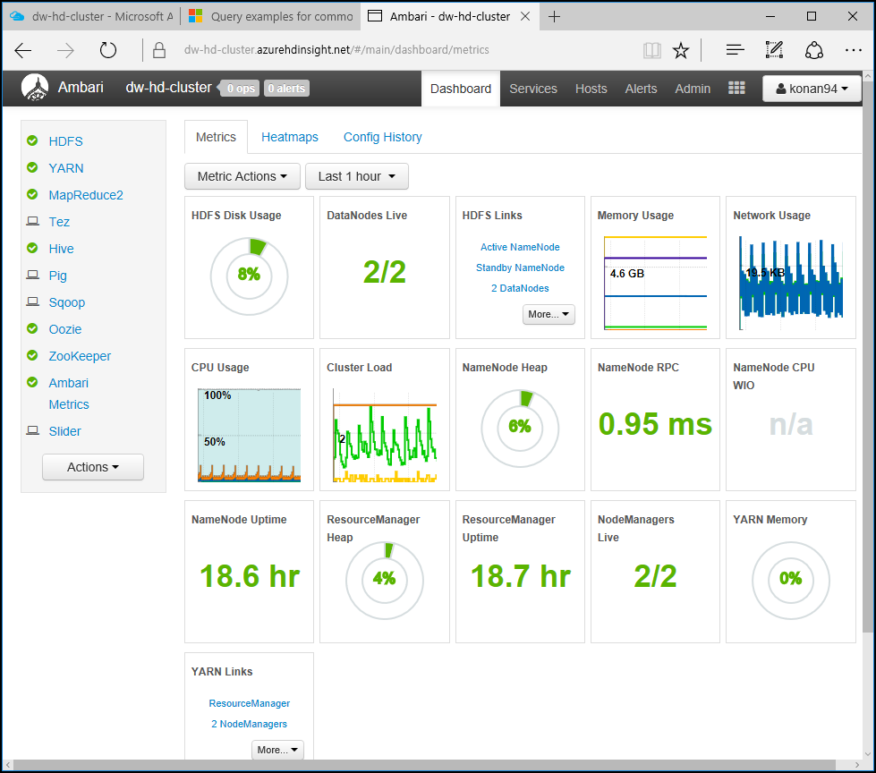
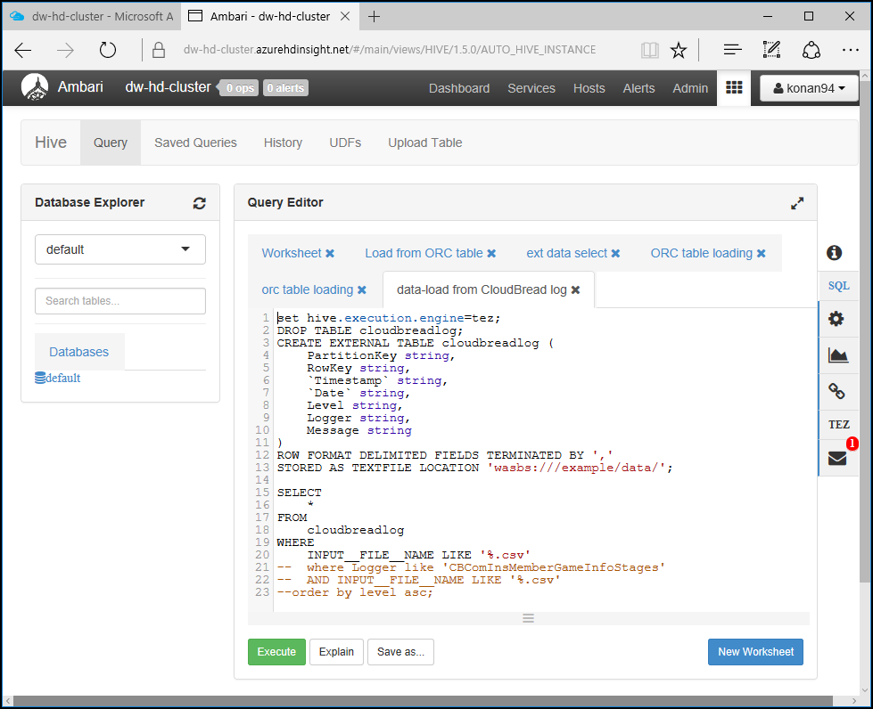

# Azure HNN project content repo
This repository built for HNN hackfest HDInsight and node.js storage code  

## Azure storage SDK code
As part of the process HNN Project to AWS S3 to Azure Blob, we provide a sampe code - how to access Azure Blob Storage using a node.js. In case of Java code, guide is provided with support of @zzz2613  

[Azure Storage sample code ofr node.js and etc.](https://github.com/hnn-project/azure-content/tree/master/demo)

### HDInsight - Preprocessing log data using Hadoop big data  
For simple data type conversion, the JSON type log data loaded in basic S3 can be easily converted into CSV type after deserializing in Azure function app. However, the log size is too large to preprocess and to become difficult log data type conversion, and it may be necessary to obtain insight from the log data for management and monitoring. To do this, we briefly performed the process of analyzing data using HDInsight – Hadoop during the Hackfest.  

- Deploying HDInsight and understand how Hadoop services work  
- Performing a Hive query on the management portal by using Ambari  
- Assuming that the entire workflow is done via the Azure Data Factory (Did not review on hackfest)  
- CSV file data is about 10,000 rows  
- Assuming that there are about 30 real estate areas, it is assumed that the analysis of how many users stay for the longest  

HDInsight's HDFS is compatible with Azure Blob Storage.  
Copy the blob using [Storage Explorer](http://storageexplorer.com). Copy the blobs to the data subdirectory of the container specified at installation. These blobs are mapped to "wasbs:///example/data/"  

  

- Structure of loaded csv file  

    PartitionKey|RowKey|Timestamp|Date|Level|Logger|Message
    ---|---|---|---|---|---|---|
    BECA21F0-8B5E-4877-A18A-FD2A4B04322D|4DC0C4A6-893C-4246-AF80-B990EDD10C54|0.011269676|2016-09-10T04:29:50.828Z|stage5|CBComInsMemberGameInfoStages|9
    6EDC9E0F-5E7E-4A04-B420-5F3091052CE7|819F7AC7-61E9-40C8-9904-B53B1008311E|0.011269676|2016-06-13T17:40:10.131Z|stage21|CBComInsMemberGameInfoStages|14
    9F86454F-4E96-4CAD-A0AE-05DED005774F|766461D9-5FE6-4135-8FB3-15AACE24C4A8|0.011269676|2016-10-18T08:06:05.589Z|stage15|CBComInsMemberGameInfoStages|7
    920E72B5-377C-4590-82D5-387ED86EF757|3AB215E0-AAE7-4E69-AF8B-825FADBAF756|0.011269676|2016-06-13T17:38:02.779Z|stage14|CBComInsMemberGameInfoStages|1
    ...
- Daily, log file include about 10,000 pieces of data, the real estate area from the client and the time information of the stay  
- Processes taking time (minutes) of message for items  
- Perform HDInsigt Cluster Manager to perform Hive queries  
-   
- Prepare Hive query execution  
-   
- Load csv files as External Table from Hive  

    ```
    set hive.execution.engine=tez;
    DROP TABLE cloudbreadlog;
    CREATE EXTERNAL TABLE cloudbreadlog (
        PartitionKey string, 
        RowKey string, 
        `Timestamp` string, 
        `Date` string, 
        Level string, 
        Logger string, 
        Message string
    )
    ROW FORMAT DELIMITED FIELDS TERMINATED BY ','
    STORED AS TEXTFILE LOCATION 'wasbs:///example/data/';
    SELECT 
        * 
    FROM 
        cloudbreadlog 
    WHERE 
        INPUT__FILE__NAME LIKE '%.csv' 
    --	where Logger like 'CBComInsMemberGameInfoStages'
    --	AND INPUT__FILE__NAME LIKE '%.csv' 
    --order by level asc;
    ```  
	Execure Hive query  

- Check whether the external table is loaded by Hive query  

    ```
    SELECT count(*) FROM cloudbreadlog;
    ```

- Load into Internal table ORC(Optimized Row Columnar) for fast processing  

    ```
    set hive.execution.engine=tez;
    CREATE TABLE IF NOT EXISTS CloudBreadStageTime(
        PartitionKey string, 
        RowKey string, 
        `Timestamp` string, 
        `Date` string, 
        Level string, 
        Logger string, 
        Message string
    )
    STORED AS ORC;
    INSERT OVERWRITE TABLE CloudBreadStageTime
    SELECT 
        PartitionKey,
        RowKey, 
        `Timestamp`, 
        `Date`, 
        Level, 
        Logger, 
        Message
    FROM 
        cloudbreadlog;
    ```

- Execute final select query on ORC table  

    ```
    select 
        level, 
        avg(cast(Message as int)) as stage_play_avg_min, 
        sum(cast(Message as int)) as stage_play_sum_min 
    from CloudBreadStageTime
    where Logger = 'CBComInsMemberGameInfoStages'
    group by level
    order by level asc;
    ```

- Average stay time and total stay time performed by region as a result of execution  
You can get Hive query results like this.  

	level|stage_play_avg_min|stage_play_sum_min
    ---|---|---|
    stage0|7.032447466|22757
    stage1|6.923216995|22812
    stage10|6.990762125|24216
    stage11|6.962710861|23527
    stage12|6.99791294|23471
    stage13|7.04329525|23426
    stage14|7.060240964|24026
    stage15|7.005102041|23341
    stage16|6.991793313|23003
    stage17|6.954984894|23021
    stage18|7.089904421|23737
    stage19|7.13037037|24065
    stage2|7.110673135|23451
    ...
- Easily visualize and publish this Hadoop analysis result to the Web using Power BI.  

-   

Various other Hadoop analysis scenarios can be derived  
- Changes in the volume of inquiries of major real estate properties  
- Grouped property information by feature  

Scenarios that utilize various logs can be used to store and analyze by Hadoop - Big data  

[hdinsight example data location](https://github.com/hnn-project/azure-content/data/)  

